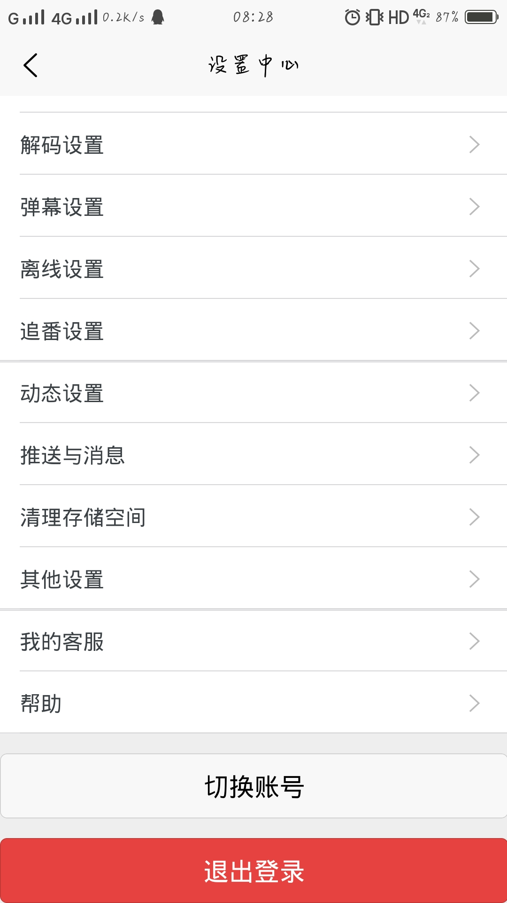
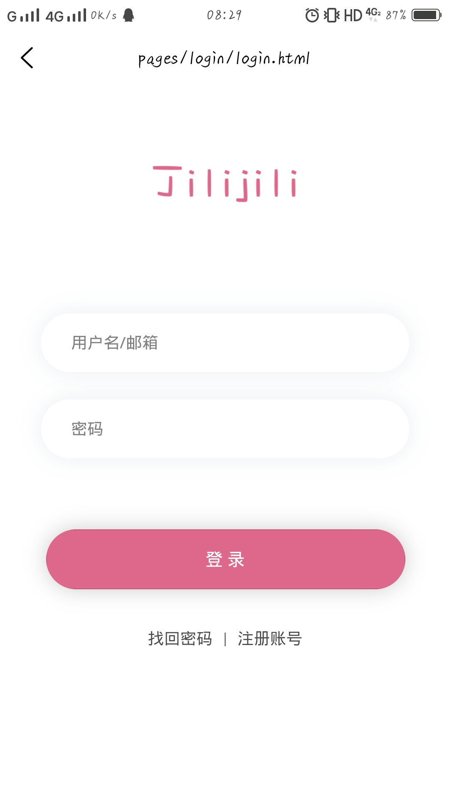

# jilijili

## 项目简介

这是一个仿`bilibili`项目

### 预览

> 路径: `doc/img`

## 开发工具
- idea
- hbuilder

## 技术架构

### 后端
- maven
- spring boot 2.2.0.RELEASE
- spring data jpa
- spring data rest
- mysql
- druid
- lombok
- ...

## 前端
- uniapp
- ...

## 开发者

- 虚位以待

## 说明

> 项目中有引用B站图片, 仅用于学习用. 如有侵权, 请联系删除.
